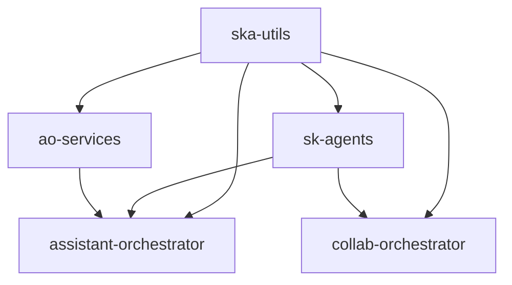

# Teal Agents Framework - Package Configuration Guide

## Overview

This guide documents the package configuration, dependency management, and build system for the Teal Agents Framework. The framework uses modern Python packaging with `uv` as the package manager and `hatch` for build automation across multiple components.

## Package Structure

### Repository Components

The Teal Agents Framework is organized as a multi-package repository with the following structure:

```
teal-agents/
├── shared/ska_utils/                    # Shared utilities package
│   ├── pyproject.toml                   # Package configuration
│   ├── src/ska_utils/                   # Source code
│   └── tests/                           # Tests
├── src/sk-agents/                       # Core framework package
│   ├── pyproject.toml                   # Package configuration
│   ├── src/sk_agents/                   # Source code
│   └── tests/                           # Tests
├── src/orchestrators/assistant-orchestrator/
│   ├── orchestrator/                    # AO orchestrator package
│   │   ├── pyproject.toml              # Package configuration
│   │   └── src/                        # Source code
│   └── services/                        # AO services package
│       ├── pyproject.toml              # Package configuration
│       └── src/                        # Source code
└── src/orchestrators/collab-orchestrator/
    └── orchestrator/                    # CO orchestrator package
        ├── pyproject.toml              # Package configuration
        └── src/                        # Source code
```

### Package Dependencies



## Core Package Configurations

### Shared Utilities (ska-utils)

**Location**: `shared/ska_utils/pyproject.toml`

```toml
[project]
name = "ska-utils"
dynamic = ["version"]
description = "Shared utilities for Teal Agents Framework"
readme = "README.md"
requires-python = ">=3.12"
dependencies = [
    "opentelemetry-exporter-otlp-proto-grpc>=1.29.0",
    "pydantic>=2.9.2",
    "python-dotenv>=1.0.1",
    "redis>=6.0.0",
]

[build-system]
requires = ["hatchling"]
build-backend = "hatchling.build"

[tool.hatch.build.targets.sdist]
include = ["src"]

[tool.hatch.build.targets.wheel]
packages = ["src/ska_utils"]

[tool.hatch.version]
path = "src/ska_utils/__about__.py"
fallback-version = "0.0.0"

[tool.hatch.metadata]
allow-direct-references = true

[dependency-groups]
dev = [
    "mypy",
    "ruff",
    "pytest",
    "coverage",
    "pytest-cov",
    "hatchling",
    "hatch",
    "freezegun",
    "pytest-mock",
    "pytest-asyncio",
]

[tool.ruff]
line-length = 100
target-version = "py312"

[tool.ruff.lint]
select = [
    "E",  # pycodestyle errors
    "W",  # pycodestyle warnings
    "F",  # pyflakes
    "I",  # isort
    "B",  # flake8-bugbear
    "C4", # flake8-comprehensions
    "UP", # pyupgrade
]
ignore = [
    "UP046", # Generic class uses Generic subclass instead of type parameters
    "UP047", # Generic function should use type parameters
]
isort = { combine-as-imports = true }

[tool.ruff.lint.pydocstyle]
convention = "google"

[tool.mypy]
strict = false
disallow_incomplete_defs = false
disallow_untyped_defs = false
disallow_untyped_calls = false
files = ["src/ska_utils/", "tests/"]
follow_imports = "skip"
python_version = 3.12

[tool.coverage.run]
source = ["src/ska_utils"]
omit = ["*/tests/*", "test_*", "__init__.py", "__about__.py"]

[tool.coverage.report]
show_missing = true
sort = "-Cover"
exclude_also = [
    "if TYPE_CHECKING:",
    "@abc.abstractmethod",
    "raise NotImplementedError",
    "logger.debug",
]
```

### Core Framework (sk-agents)

**Location**: `src/sk-agents/pyproject.toml`

```toml
[project]
name = "sk-agents"
dynamic = ["version"]
description = "Teal Agents Framework - Core agent execution engine"
readme = "README.md"
requires-python = ">=3.11"
dependencies = [
    "fastapi>=0.104.1",
    "uvicorn[standard]>=0.24.0",
    "pydantic>=2.5.0",
    "semantic-kernel>=1.0.0",
    "openai>=1.3.0",
    "anthropic>=0.7.0",
    "google-generativeai>=0.3.0",
    "redis>=5.0.0",
    "aiofiles>=23.2.1",
    "python-multipart>=0.0.6",
    "ska-utils",
]

[build-system]
requires = ["hatchling"]
build-backend = "hatchling.build"

[tool.hatch.build.targets.wheel]
packages = ["src/sk_agents"]

[tool.hatch.version]
path = "src/sk_agents/__about__.py"

[dependency-groups]
dev = [
    "pytest>=7.4.0",
    "pytest-asyncio>=0.21.0",
    "pytest-cov>=4.1.0",
    "pytest-mock>=3.11.0",
    "httpx>=0.25.0",
    "ruff>=0.1.0",
    "mypy>=1.6.0",
    "hatch>=1.7.0",
]

docs = [
    "mkdocs>=1.5.0",
    "mkdocs-material>=9.4.0",
    "mkdocstrings[python]>=0.23.0",
]

[tool.ruff]
line-length = 100
target-version = "py311"

[tool.ruff.lint]
select = ["E", "W", "F", "I", "B", "C4", "UP"]
ignore = ["E501", "B008"]

[tool.mypy]
python_version = "3.11"
strict = true
warn_return_any = true
warn_unused_configs = true
disallow_untyped_defs = true

[tool.pytest.ini_options]
testpaths = ["tests"]
python_files = ["test_*.py"]
python_classes = ["Test*"]
python_functions = ["test_*"]
addopts = [
    "--strict-markers",
    "--strict-config",
    "--cov=src/sk_agents",
    "--cov-report=term-missing",
    "--cov-report=html",
    "--cov-report=xml",
]

[tool.coverage.run]
source = ["src/sk_agents"]
omit = [
    "*/tests/*",
    "*/test_*",
    "*/__init__.py",
    "*/__about__.py",
]

[tool.coverage.report]
exclude_lines = [
    "pragma: no cover",
    "def __repr__",
    "if self.debug:",
    "if settings.DEBUG",
    "raise AssertionError",
    "raise NotImplementedError",
    "if 0:",
    "if __name__ == .__main__.:",
    "class .*\\bProtocol\\):",
    "@(abc\\.)?abstractmethod",
]
```

## Dependency Management

### Version Pinning Strategy

The framework uses a **compatible release** strategy for dependencies:

- **Core dependencies**: Pinned to minor versions (e.g., `>=1.0.0,<2.0.0`)
- **Development dependencies**: Pinned to major versions (e.g., `>=7.4.0`)
- **Security-critical dependencies**: Exact version pinning when necessary

### Dependency Groups

Each package defines dependency groups for different use cases:

```toml
[dependency-groups]
dev = [
    "pytest>=7.4.0",
    "ruff>=0.1.0",
    "mypy>=1.6.0",
]

docs = [
    "mkdocs>=1.5.0",
    "mkdocs-material>=9.4.0",
]

test = [
    "pytest-cov>=4.1.0",
    "pytest-mock>=3.11.0",
    "httpx>=0.25.0",
]

security = [
    "bandit>=1.7.0",
    "safety>=2.3.0",
]
```

### Installing Dependencies

```bash
# Install production dependencies
uv sync

# Install with development dependencies
uv sync --group dev

# Install specific groups
uv sync --group dev --group docs

# Install all groups
uv sync --all-groups
```

## Build System Configuration

### Hatch Build Backend

All packages use `hatchling` as the build backend with consistent configuration:

```toml
[build-system]
requires = ["hatchling"]
build-backend = "hatchling.build"

[tool.hatch.build.targets.wheel]
packages = ["src/package_name"]

[tool.hatch.build.targets.sdist]
include = [
    "src/",
    "tests/",
    "README.md",
    "LICENSE",
]
exclude = [
    "*.pyc",
    "__pycache__/",
    ".git/",
    ".pytest_cache/",
    "*.egg-info/",
]
```

### Version Management

#### Dynamic Versioning

All packages use dynamic versioning with `hatch`:

```toml
[project]
dynamic = ["version"]

[tool.hatch.version]
path = "src/package_name/__about__.py"
fallback-version = "0.0.0"
```

#### Version File Format

```python
# src/package_name/__about__.py
"""Package version information."""

__version__ = "1.2.3"
```

#### Version Bumping

```bash
# Development version bump
uv run hatch version dev

# Release version bump
uv run hatch version release

# Specific version bump
uv run hatch version 1.2.3

# Patch version bump
uv run hatch version patch

# Minor version bump
uv run hatch version minor

# Major version bump
uv run hatch version major
```

## Code Quality Configuration

### Ruff Configuration

Consistent linting and formatting across all packages:

```toml
[tool.ruff]
line-length = 100
target-version = "py311"
src = ["src", "tests"]

[tool.ruff.lint]
select = [
    "E",   # pycodestyle errors
    "W",   # pycodestyle warnings
    "F",   # pyflakes
    "I",   # isort
    "B",   # flake8-bugbear
    "C4",  # flake8-comprehensions
    "UP",  # pyupgrade
    "N",   # pep8-naming
    "S",   # flake8-bandit
    "T20", # flake8-print
    "SIM", # flake8-simplify
]

ignore = [
    "E501",  # Line too long (handled by formatter)
    "B008",  # Do not perform function calls in argument defaults
    "S101",  # Use of assert detected
    "T201",  # Print found
]

[tool.ruff.lint.per-file-ignores]
"tests/*" = ["S101", "T201", "B011"]
"__init__.py" = ["F401"]

[tool.ruff.lint.isort]
combine-as-imports = true
force-wrap-aliases = true
known-first-party = ["ska_utils", "sk_agents"]

[tool.ruff.lint.pydocstyle]
convention = "google"
```

### MyPy Configuration

Type checking configuration:

```toml
[tool.mypy]
python_version = "3.11"
strict = true
warn_return_any = true
warn_unused_configs = true
disallow_untyped_defs = true
disallow_incomplete_defs = true
check_untyped_defs = true
disallow_untyped_decorators = true
no_implicit_optional = true
warn_redundant_casts = true
warn_unused_ignores = true
warn_no_return = true
warn_unreachable = true

# Per-module options
[[tool.mypy.overrides]]
module = "tests.*"
disallow_untyped_defs = false
disallow_incomplete_defs = false

[[tool.mypy.overrides]]
module = [
    "semantic_kernel.*",
    "openai.*",
    "anthropic.*",
    "google.generativeai.*",
]
ignore_missing_imports = true
```

### Test Configuration

#### Pytest Configuration

```toml
[tool.pytest.ini_options]
testpaths = ["tests"]
python_files = ["test_*.py", "*_test.py"]
python_classes = ["Test*"]
python_functions = ["test_*"]
addopts = [
    "--strict-markers",
    "--strict-config",
    "--cov=src",
    "--cov-report=term-missing:skip-covered",
    "--cov-report=html",
    "--cov-report=xml",
    "--cov-fail-under=80",
]
markers = [
    "slow: marks tests as slow (deselect with '-m \"not slow\"')",
    "integration: marks tests as integration tests",
    "unit: marks tests as unit tests",
]
filterwarnings = [
    "error",
    "ignore::UserWarning",
    "ignore::DeprecationWarning",
]
```

#### Coverage Configuration

```toml
[tool.coverage.run]
source = ["src"]
omit = [
    "*/tests/*",
    "*/test_*",
    "*/__init__.py",
    "*/__about__.py",
    "*/conftest.py",
]
branch = true

[tool.coverage.report]
exclude_lines = [
    "pragma: no cover",
    "def __repr__",
    "if self.debug:",
    "if settings.DEBUG",
    "raise AssertionError",
    "raise NotImplementedError",
    "if 0:",
    "if __name__ == .__main__.:",
    "class .*\\bProtocol\\):",
    "@(abc\\.)?abstractmethod",
    "TYPE_CHECKING",
]
show_missing = true
sort = "-Cover"
precision = 2
```

## Environment Configuration

### Environment Variables

#### Package-Specific Variables

```bash
# uv configuration
UV_CACHE_DIR=/tmp/uv-cache
UV_PYTHON=3.12
UV_INDEX_URL=https://pypi.org/simple/

# Build configuration
HATCH_BUILD_CLEAN=true
HATCH_BUILD_NO_HOOKS=false

# Development configuration
PYTHONPATH=src
PYTHONDONTWRITEBYTECODE=1
PYTHONUNBUFFERED=1
```

#### CI/CD Variables

```bash
# GitHub Actions
GITHUB_TOKEN=<token>
PYPI_TOKEN=<token>

# Docker registry
DOCKER_REGISTRY=ghcr.io
DOCKER_USERNAME=<username>
DOCKER_PASSWORD=<password>

# Testing
PYTEST_ADDOPTS=--tb=short
COVERAGE_FAIL_UNDER=80
```

### Development Environment Setup

#### Local Development

```bash
# Clone repository
git clone https://github.com/thepollari/teal-agents.git
cd teal-agents

# Install uv (if not already installed)
curl -LsSf https://astral.sh/uv/install.sh | sh

# Set up each package
cd shared/ska_utils
uv sync --group dev
cd ../../src/sk-agents
uv sync --group dev
cd ../orchestrators/assistant-orchestrator/orchestrator
uv sync --group dev
```

#### Docker Development

```dockerfile
# Development Dockerfile
FROM python:3.12-slim

# Install uv
COPY --from=ghcr.io/astral-sh/uv:latest /uv /bin/uv

# Set working directory
WORKDIR /app

# Copy package files
COPY pyproject.toml uv.lock ./
COPY src/ src/

# Install dependencies
RUN uv sync --frozen --no-dev

# Set environment
ENV PYTHONPATH=/app/src
ENV PYTHONDONTWRITEBYTECODE=1
ENV PYTHONUNBUFFERED=1

# Run application
CMD ["uv", "run", "uvicorn", "sk_agents.app:app", "--host", "0.0.0.0", "--port", "8000"]
```

## Package Publishing

### Build Process

```bash
# Build package
uv build

# Build with specific target
uv build --wheel
uv build --sdist

# Clean build
rm -rf dist/
uv build
```

### Publishing Configuration

#### PyPI Configuration

```toml
# pyproject.toml
[project.urls]
Homepage = "https://github.com/thepollari/teal-agents"
Documentation = "https://teal-agents.readthedocs.io"
Repository = "https://github.com/thepollari/teal-agents.git"
Issues = "https://github.com/thepollari/teal-agents/issues"
Changelog = "https://github.com/thepollari/teal-agents/blob/main/CHANGELOG.md"

[project.optional-dependencies]
dev = [
    "pytest>=7.4.0",
    "ruff>=0.1.0",
    "mypy>=1.6.0",
]

[project.scripts]
teal-agents = "sk_agents.cli:main"
```

#### GitHub Actions Publishing

```yaml
# .github/workflows/publish.yml
name: Publish Packages

on:
  release:
    types: [published]

jobs:
  publish:
    runs-on: ubuntu-latest
    steps:
    - uses: actions/checkout@v4
    
    - name: Set up uv
      uses: astral-sh/setup-uv@v1
    
    - name: Build packages
      run: |
        cd shared/ska_utils && uv build
        cd ../../src/sk-agents && uv build
        cd ../orchestrators/assistant-orchestrator/orchestrator && uv build
    
    - name: Publish to PyPI
      env:
        TWINE_USERNAME: __token__
        TWINE_PASSWORD: ${{ secrets.PYPI_TOKEN }}
      run: |
        uv tool run twine upload shared/ska_utils/dist/*
        uv tool run twine upload src/sk-agents/dist/*
        uv tool run twine upload src/orchestrators/assistant-orchestrator/orchestrator/dist/*
```

## Dependency Security

### Security Scanning

```bash
# Check for known vulnerabilities
uv tool run safety check

# Audit dependencies
uv tool run pip-audit

# Check for outdated packages
uv tool run pip list --outdated
```

### Automated Security Updates

```yaml
# .github/workflows/security.yml
name: Security Scan

on:
  schedule:
    - cron: '0 2 * * *'  # Daily at 2 AM
  push:
    branches: [main]

jobs:
  security:
    runs-on: ubuntu-latest
    steps:
    - uses: actions/checkout@v4
    
    - name: Set up uv
      uses: astral-sh/setup-uv@v1
    
    - name: Install dependencies
      run: uv sync --group dev
    
    - name: Run safety check
      run: uv tool run safety check --json --output safety-report.json
    
    - name: Run bandit security linter
      run: uv tool run bandit -r src/ -f json -o bandit-report.json
    
    - name: Upload security reports
      uses: actions/upload-artifact@v3
      with:
        name: security-reports
        path: |
          safety-report.json
          bandit-report.json
```

## Troubleshooting

### Common Issues

#### Dependency Resolution Conflicts

```bash
# Clear uv cache
uv cache clean

# Force reinstall
uv sync --reinstall

# Check dependency tree
uv tree

# Resolve specific conflicts
uv add "package>=1.0.0,<2.0.0"
```

#### Build Failures

```bash
# Clean build artifacts
rm -rf dist/ build/ *.egg-info/

# Verbose build
uv build --verbose

# Check build requirements
uv run hatch build --help
```

#### Version Conflicts

```bash
# Check current version
uv run hatch version

# Reset version
uv run hatch version 0.1.0

# Sync versions across packages
./scripts/sync-versions.sh
```

### Development Workflow

#### Pre-commit Hooks

```yaml
# .pre-commit-config.yaml
repos:
  - repo: https://github.com/astral-sh/ruff-pre-commit
    rev: v0.1.0
    hooks:
      - id: ruff
        args: [--fix, --exit-non-zero-on-fix]
      - id: ruff-format

  - repo: https://github.com/pre-commit/mirrors-mypy
    rev: v1.6.0
    hooks:
      - id: mypy
        additional_dependencies: [types-all]

  - repo: https://github.com/pre-commit/pre-commit-hooks
    rev: v4.4.0
    hooks:
      - id: trailing-whitespace
      - id: end-of-file-fixer
      - id: check-yaml
      - id: check-added-large-files
```

#### Development Scripts

```bash
#!/bin/bash
# scripts/dev-setup.sh

set -e

echo "Setting up development environment..."

# Install uv if not present
if ! command -v uv &> /dev/null; then
    curl -LsSf https://astral.sh/uv/install.sh | sh
fi

# Set up each package
packages=(
    "shared/ska_utils"
    "src/sk-agents"
    "src/orchestrators/assistant-orchestrator/orchestrator"
    "src/orchestrators/assistant-orchestrator/services"
    "src/orchestrators/collab-orchestrator/orchestrator"
)

for package in "${packages[@]}"; do
    echo "Setting up $package..."
    cd "$package"
    uv sync --group dev
    cd - > /dev/null
done

# Install pre-commit hooks
uv tool install pre-commit
pre-commit install

echo "Development environment setup complete!"
```

This comprehensive package configuration guide ensures consistent, maintainable, and secure package management across the entire Teal Agents Framework ecosystem.
