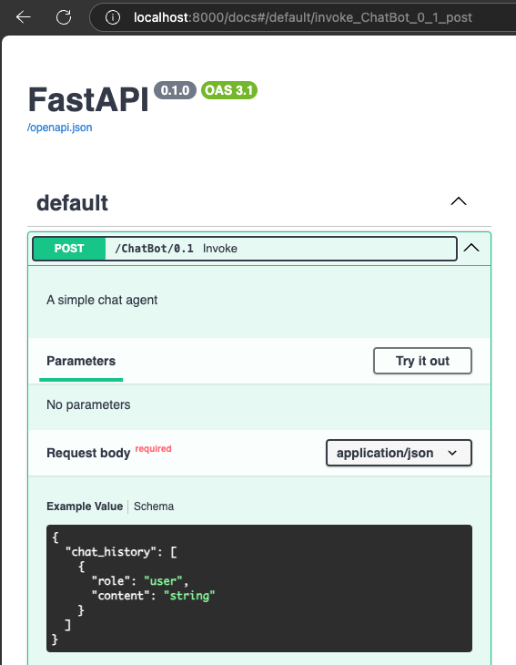

# Teal Agents Framework

Teal Agent Framework is a (early!) prototype framework meant to accelerate the
creation and deployment of AI-powered agents. The framework is built on top of
Microsoft's
[Semantic Kernel](https://learn.microsoft.com/en-us/semantic-kernel/overview/),
a lightweight, open source, agent framework.

Building upon Semantic Kernel, the Teal Agent Framework takes a config-first
approach to the creation of agents. The majority of setup is performed in an
agent's configuration file and you have the option to add in custom code to
enhance your agent's capability.

## Prerequisites
- Python 3.11 or higher
- An appropriate API key for the LLM of your choice
- Docker (or comparable equivalent)

## Running a simple demo
Running locally will allow you to test your agent's configuration and code.
First, clone the repository locally and install all dependencies. In this
I'm using `uv` as an environment manager.

```bash
$ git clone https://github.com/MSDLLCpapers/teal-agents
$ cd teal-agents/src/sk-agents
$ uv sync
```

Once cloned, you'll need to set up an environment file which will provide your
LLM API key and point to the correct agent configuration file. Create a `.env`
file in the root of the repository and add the following:

```text
TA_API_KEY=<your-API-key>
TA_SERVICE_CONFIG=demos/01_getting_started/config.yaml
```

Finally, start the agent using fastapi via either using `uv run` or after
activating your environment.

```bash
$ uv run -- fastapi run src/sk_agents/app.py
```
or
```bash
$ source .venv/bin/activate
$ fastapi run src/sk_agents/app.py
```


You can test the agent by visiting http://localhost:8000/docs



### Additional Documentation
- [Configuring an Agent](/src/sk-agents/demos/01_getting_started/README.md)
- [Working with Input and Output](/src/sk-agents/demos/02_input_output/README.md)
- [Creating Custom Plugins](/src/sk-agents/demos/03_plugins/README.md)
- [Using Remote Plugins](/src/sk-agents/demos/04_remote_plugins/README.md)
- [Docker Deployment (Basic)](/src/sk-agents/demos/05_deployment/README.md)
- [Github Deployment](/src/sk-agents/demos/06_deployment_github/README.md)
- [Task Output](/src/sk-agents/demos/07_task_output/README.md)
- [Multi-Modal Input](/src/sk-agents/demos/08_multi_modal/README.md)
