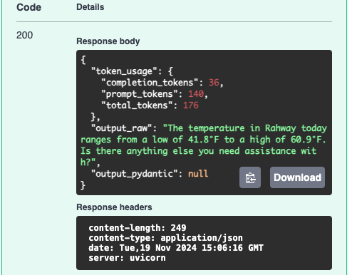

# Plugins
Plugins are a concept unique to Semantic Kernel, in the agent framework space.
Rather than giving agents access to individual tools, SK introduces the concept
of plugins, which can be bundles of similar tools, thus more closely aligning
with traditional concepts in software development around the creation of APIs.

In the SK Agent Framework, plugins can be included in two ways:
1. Local/Custom Plugins
2. OpenAPI API Plugins

### Local/Custom Plugins
Local plugins are plugins that are created by the user and are specific to this
agent. To create one, simply create a new Python file which will be included
with your agent. The file should contain one or more plugin classes which are
derived from `BasePlugin` in the `ska_types` module and which contain methods
annotated with the `kernel_function` annotation from Semantic Kernel
(`semantic_kernel.functions.kernel_function_decorator`).

#### Authorization & Extra Data
Your custom plugin classes MUST inherit from BasePlugin. This base class has an
`__init__` method which accepts two arguments:

* `authorization` which contains the value contained in the `Authorization`
   header received from the client, if one is present. You can access the
   authorization token (if present) via `self.authorization`.
* `extra_data_collector` which contains an instance of `ExtraDataCollector`
   which can be used to add extra data to the response. Extra data comes in the
   format of key/value pairs. Use the `add_extra_data` method within the plugin
   to include extra data.

If you're overriding the `__init__` method in your custom plugin,
make sure to call the base class's `__init__` method with the `authorization`
and `extra_data` arguments.

#### Example
In this example, we've defined a `WeatherPlugin` which contains two annotated
methods `gat_lat_lng_for_location` and `get_temperature`. The first method takes
as input a location search string and returns the latitude, longitude, and
timezone of the location. The second method takes as input the latitude,
longitude, and timezone of a location and returns the low and high temperatures.

```python
...
class WeatherPlugin(BasePlugin):
   @staticmethod
   def _get_temp_url_for_location(lat: float, lng: float, timezone: str) -> str:
      return f"https://api.open-meteo.com/v1/forecast?latitude={str(lat)}&longitude={str(lng)}&daily=temperature_2m_max,temperature_2m_min&temperature_unit=fahrenheit&wind_speed_unit=mph&precipitation_unit=inch&timezone={timezone}&forecast_days=1"

   @staticmethod
   def _get_loc_url_for_location(self, location_string: str) -> str:
      return f"http://api.geonames.org/searchJSON?formatted=true&q={location_string}&maxRows=1&lang=en&username=tealagents&style=full"

   @kernel_function(
      description="Retrieve low and high temperatures for the day for a given location"
   )
   def get_temperature(
           self, lat: float, lng: float, timezone: str
   ) -> TemperatureResponse:
      url = WeatherPlugin._get_temp_url_for_location(lat, lng, timezone)

      response = requests.get(url).json()
      if response:
         response_int: TemperatureResponseInt = TemperatureResponseInt(**response)
         return TemperatureResponse(
            low=response_int.daily.temperature_2m_min[0],
            high=response_int.daily.temperature_2m_max[0],
         )
      else:
         raise ValueError(f"Error retrieving temperature")

   @kernel_function(
      description="Retrieve the latitude, longitude, and timezone for a given location search string"
   )
   def get_lat_lng_for_location(self, location_string: str) -> LocationCoordinates:
      url = WeatherPlugin._get_loc_url_for_location(self, location_string)

      response = requests.get(url).json()
      if response:
         response_int: CoordsResponse = CoordsResponse(**response)
         return LocationCoordinates(
            latitude=response_int.geonames[0].lat,
            longitude=response_int.geonames[0].lng,
            timezone=response_int.geonames[0].timezone.timeZoneId,
         )
      else:
         raise ValueError(f"Error retrieving location coordinates")
```

Once the custom plugin has been defined, you need to make it available to a
configured agent in your agent configuration file. Do this by populating the
plugins portion of the agent configuration, which takes a list of defined
plugins.

```yaml
...
    spec:
      agents:
        - name: default
          role: Default Agent
          model: gpt-4o
          system_prompt: >
            You are a helpful assistant.
          plugins:
          - WeatherPlugin
...
```

Finally, we need to update our environment to specify the python file which
contains the custom plugin.

```text
TA_API_KEY=<your-API-key>
TA_SERVICE_CONFIG=demos/03_plugins/config.yaml
TA_PLUGIN_MODULE=demos/03_plugins/custom_plugins.py
```

And that's all you need to do. In this example, the agent is a chat agent,
similar to example 1, but now it has the ability to retrieve the temperature
for a specified location.



