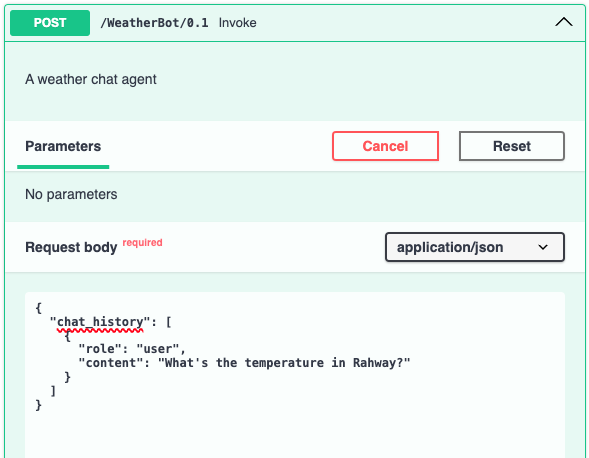
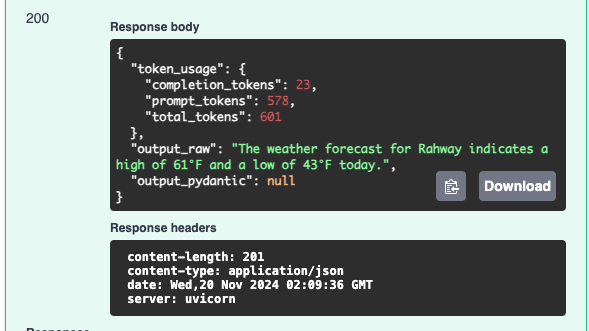

# Plugins
Plugins are a concept unique to Semantic Kernel, in the agent framework space.
Rather than giving agents access to individual tools, SK introduces the concept
of plugins, which can be bundles of similar tools, thus more closely aligning
with traditional concepts in software development around the creation of APIs.

In the Teal Agent Framework, plugins can be included in two ways:

1. Local/Custom Plugins
2. OpenAPI API Plugins

### Remote Plugins
Remote plugins allow you to re-use existing, published APIs as plugins for your
agent without having to write any code. To enable an API as a remote plugin for
your agent, two conditions must be met:

1. The API has a valid OpenAPI Swagger document
2. The API is defined in the Remote Plugin Catalog

**Note**: At present, the Remote Plugin Catalog is simply a YAML file you will
define when creating an agent. In the future, there are plans to manage the
available remote plugins via a centralized catalog.

### Example
In this example, we'll use two APIs.

1. An API which, given a location search string, returns a number of
   geographical details about the location, including its latitude, longitude,
   and timezone.
2. An API which, given a latitude and longitude, returns the high and low
   temperatures for the location.

To set up the remote plugin, we've provided the OpenAPI Swagger documents for
both APIs in this directory (`openapi_weather.json` and
`openapi_geonames.json`). Note, the Swagger document locations could also be
URLs, rather than local files.

Additionally, we've created a `remote-plugin-catalog.yaml` file which defines
the details of the remote APIs.

```yaml
remote_plugins:
  - plugin_name: api_weather
    openapi_json_path: ./demos/04_remote_plugins/openapi_weather.json
    server_url: https://api.open-meteo.com
  - plugin_name: api_geonames
    openapi_json_path: ./demos/04_remote_plugins/openapi_geonames.json
```

In the configuration file, we reference the remote plugins in the agent section.
Note that the remote plugin names are defined in the catalog file.

```yaml
...
spec:
  agents:
    - name: default
      role: Default Agent
      model: gpt-4o
      system_prompt: >
        You are a helpful assistant.
      remote_plugins:
      - api_weather
      - api_geonames
...
```

Finally, in our environment variables, we provide the path to the local remote
plugin catalog.

```text
TA_API_KEY=<your-API-key>
TA_SERVICE_CONFIG=demos/04_remote_plugins/config.yaml
TA_REMOTE_PLUGIN_PATH=demos/04_remote_plugins/remote-plugin-catalog.yaml
```

Now when we run and execute the agent (still using the chat-style input from
earlier examples), requesting the temperature for Rahway, we see that the agent
leverages both of the remote plugins to satisfy the request, first searching for
the location coordinates using the geonames API, and then retrieving temperature
using the openmeteo API.




