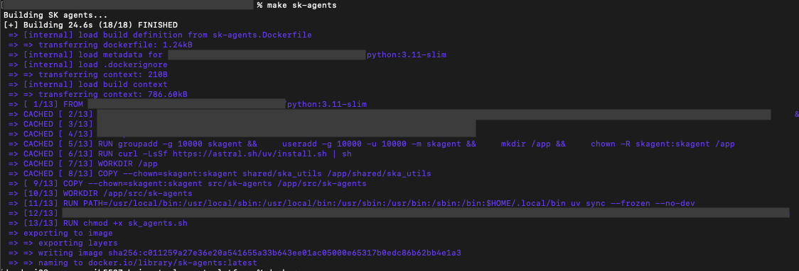

# Deployment
Agents will be packaged and deployed as docker containers. While this capability
is not fully developed, yet, this example will give you an idea of how it might
eventually be realized.

### Building the base image
Eventually, the base image would be available in Docker Hub, and to get started
you'd need to simply pull that image down. Until then, you'll need to first
build the base image, locally.  To do so, once you've cloned the repository,
locally, build the base image by running the following command from the root.

```shell
$ git clone https://github.com/MSDLLCpapers/teal-agents.git
$ cd teal-agents
$ make teal-agents
```



### Running the agent
To run your agent with the base image, you'll need to make your configuration
code files available to a running container and provide it with the appropriate
environment variables referencing where you've mounted your files.

**Note**: We'll be running the same example as shown in demo 4, but now we'll be
running it within the container.

First, set up your environment (.env) file as follows:

```text
TA_API_KEY=<your-API-key>
TA_SERVICE_CONFIG=agents/config.yaml
TA_PLUGIN_MODULE=agents/custom_plugins.py
TA_REMOTE_PLUGIN_PATH=agents/remote-plugin-catalog.yaml
```

We'll use this file to set the environment for our running container. Note that
the path we're specifying to all of our configuration is in the `agents` folder.
That means we'll have to mount all of these files to that location in the
container.

Also, since we're now moving everything inside the container, we'll need to
update the remote plugin catalog (which references the local swagger file).

```yaml
remote_plugins:
  - plugin_name: api_weather
    openapi_json_path: ./agents/openapi_weather.json
    server_url: https://api.open-meteo.com
```

For this example, we'll use docker compose to start the agent using the base
container. In our `compose.yaml` file, we expose port 8000, leverage the
environment file we previously created, and tell it to mount all of our
configuration files in the `/app/src/sk-agents/agents` directory in the
container.

```yaml
services:
  teal-agents:
    image: localhost/teal-agents:latest
    ports:
      - "8000:8000"
    env_file: ".env"
    volumes:
      - ./agents:/app/src/sk-agents/agents
```

Start the container

```shell
$ docker compose up -d
```

The agent will now be running and available on port 8000, just as in demo 4.


### Adding Dependencies
If your agent plugins require additional pip dependencies, simply add a
`requirements.txt` file to your agent directory. When you start the agent, the
listed dependencies will be automatically installed in the container and
available for your plugins. If your additional dependencies are listed in a file
named something other than `requirements.txt`, you can specify the file name
using the environment variable `TA_ADDL_REQUIREMENTS` (note that this variable
must prefix the file name with /src/sk-agents/agents/ as this is where the files
are available within the container).
