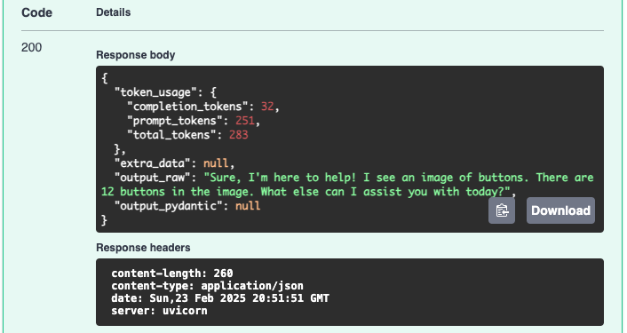

# Multi-Modal Input

In addition to text prompts, agents can work with multi-modal input (currently
limited to images, but more are planned). There are two ways to leverage image
input in an agent:

### BaseMultiModalInput

If you set the `input_type` to `BaseMultiModalInput`, the agent will expect a
chat history that can include images as items in a user message.

```yaml
apiVersion: skagents/v1
kind: Sequential
description: >
  A simple chat agent
service_name: ChatBot
version: 0.1
input_type: BaseMultiModalInput
spec:
  agents:
    - name: default
      role: Default Agent
      model: gpt-4o
      system_prompt: >
        You are a helpful assistant.
  tasks:
    - name: action_task
      task_no: 1
      description: Chat with user
      instructions: >
        Work with the user to assist them in whatever they need.
      agent: default
```

The `items` key within the request payload can now include both text and images.
The `content_type` key specifies the type of item and `content` contains the
actual content.
```json
{
  "chat_history": [
    {
      "role": "user",
      "items": [
        {
          "content_type": "text or image",
          "content": "content"
        }
      ]
    }
  ]
}
```
When specifying an image, it must be base64-encoded, and prefixed with
`data:image/jpeg;base64,` (substituting the appropriate format).  For example,
to have the agent count the number of buttons, in this image:


Our request payload would look like:
```json
{
  "chat_history": [
    {
      "role": "user",
      "items": [
        {
          "content_type": "text",
          "content": "How many buttons are in this image"
        },
        {
          "content_type": "image",
          "content": "data:image/jpeg;base64,/9j/4QF..."
        }
      ]
    }
  ]
}
```

Note: To simplify testing of this demo, the example request payload is stored in
[request_payload.json](request_payload.json).

### Result


### Embedded Image
An alternative method of including images for your agent to process would be to
define a custom input type that includes a field called `embedded_image` whose
structure matches:

```json
{
  ...
  "embedded_image": {
    "format": "image/jpeg",
    "content": "/9j/4QF..."
  }
}
```

When including images in this way, the image will be sent along with your first
task's instructions.

#### Example
Define a custom input type:
```python
from semantic_kernel.kernel_pydantic import KernelBaseModel

from sk_agents.ska_types import EmbeddedImage


class ButtonGuess(KernelBaseModel):
    guess: int
    embedded_image: EmbeddedImage
```

And your agent configuration looked like this:
```yaml
apiVersion: skagents/v1
kind: Sequential
description: >
  A simple chat agent
service_name: ChatBot
version: 0.1
input_type: ButtonGuess
spec:
  agents:
    - name: default
      role: Default Agent
      model: gpt-4o
      system_prompt: >
        You are a helpful assistant.
  tasks:
    - name: action_task
      task_no: 1
      description: Chat with user
      instructions: >
        Does the image contain {{guess}} buttons?
      agent: default
```

You could send a payload that looked like this:
```json
{
  "guess": 10,
  "embedded_image": {
    "format": "image/jpeg",
    "data": "/9j/4Q..."
  }
}
```

The image in the payload would be detected and sent along with the user message
"Does the image contain 10 buttons?". Your response would look something like:
```json
{
  "token_usage": {
    "completion_tokens": 9,
    "prompt_tokens": 235,
    "total_tokens": 244
  },
  "extra_data": null,
  "output_raw": "No, the image contains 12 buttons.",
  "output_pydantic": null
}
```
